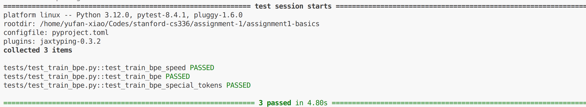
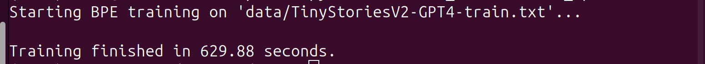
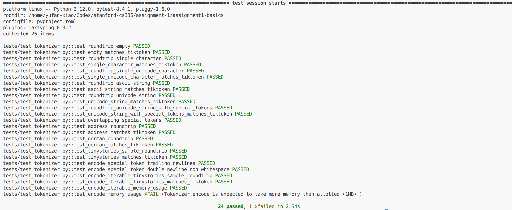

# Assignment1 Development Log


## 1.1 BPE Tokenizer Training: `train_bpe()`

Implement train_bpe() to train a BPE tokenizer from scratch. The implementation is in `cs336_basics/train_bpe.py`. 

The basic idea is to devide it into three process: intializing vocabulary, parallelly pretokenizing and computing merges.

See input and output details here:
```python
def train_bpe(
        input_path: str,
        vocab_size: int,
        special_tokens: list[str]
) -> tuple[dict[int,bytes], list[tuple[bytes, bytes]]]:
    
    # initialize vocabulary
    vocab = init_vocab(special_tokens)

    # pretokenization and word frequency counting
    pre_token_counts = parallel_pre_tokenize(input_path, special_tokens)

    # iteratively calculate and merge
    vocab, merges = compute_merges(vocab, pre_token_counts, vocab_size)

    # return vocab and merges
    return vocab, merges
    
```

### init_vocab()

Initialize the vocabulary with all 256 bytes. `vocab` is a dictionary. It's keys are ID of tokens, which are integer indices, and it's values are tokens encoded with "utf-8". 

`init_vocab()` receives a list of special tokens and adds them at the end of the `vocab`, then returns the `vocab`.

### parallel_pre_token()

`parallel_pre_token()` receives `input_path` and `special_tokens`. After pretokenizing, it returns `pre_token_counts` which is a dictionary containing all pre-tokens(tuple of bytes) and their frequency (which is large enough to be the memory bottleneck).

To improve efficiency, use `multiprocessing` to distribute the work to multiple workers on CPU.

1. Open the dataset file and use the helper function, `find_chunk_boundaries()` (defined in `pretokenization_example`) to chunk the whole dataset. 

2. Each chunk will be handled by one process with `process_chunk` function.

3. Results from different processes will be merge into a final `Counter()`.

### process_chunk()

1. Split the chunk on special tokens to ensure the completeness of the special tokens and that the pretoken won't cross the boudaries. Before passing the special tokens to `re.split`, use `re.escape` to escape them;

2. For each splited chunk, pretokenize them by `PAT = r"""'(?:[sdmt]|ll|ve|re)| ?\p{L}+| ?\p{N}+| ?[^\s\p{L}\p{N}]+|\s+(?!\S)|\s+"""`, get a list of pretokens(string);

3. Encode the pretokens with "utf-8", and use a `Counter` to counter their frequency;

4. Return the `Counter()`, `pre_token_counts`

### compute_merges()

`compute_merges()` receives `vocab`, `vocab_size` and `pre_token_counts`, computes the frequency of token pairs, merges to create a vocabulary of `vocab_size` and finally returns `vocab` and `merges` (containing the merges order).

1. Iterate `pre_token_counts` and bytes within the token to get a dictionary of byte-pair frequency, `pair_counts`, with keys are tuples containing bytes.

2. Create a loop, while the vocabulary hasn't reached the size:

3. Get the `best_pair` with higher byte-pair, put it into `merges`list; merge them into one token `merged_pair` (not tuple anymore), put `merged_pair` into vocabulary;

4. Update the `pre_token_counts` by iterating it, merging all `best_pair` found and updating their neighbour pair's frequency in `pair_counts` accordingly.

5. Once the vocabulary reaches `vocab_size`, return it along with `merges`

### Test `train_bpe()`

1. Modify `/test/adapters.run_train_bpe` by importing `train_bpe()` and returning it's result;

From `/assignment1-basics` run:
```
uv run pytest tests/test_train_bpe.py
```

The result should be as following:



### Train BPE tokenizer on TinyStories dataset

In ``train_bpe.py`, specify the following arguments:

```python
input_path = "data/TinyStoriesV2-GPT4-train.txt"
vocab_size = 10000
special_tokens = ["<|endoftext|>"]
vocab_out_path = "data/vocab_TinyStories.txt"
merges_out_path = "data/merges_TinyStories.txt"
```
Pass according auguments to `train_bpe()` and store `vocab` and `merges` in output files.

From `/assignment1-basics` run:
```
python -m cs336_basics.train_bpe
```

The result is as following:


It requires a maximum CPU memory of about 119G, so I run it in a rented 256G CPU, and it took 630 seconds to finish training.

***Note: Here is the most confusing point, in the assignment description it states the training should require ≤ 30GB RAM, but 119G is far more than that.***

Then we have two files in `/data`: `vocab_TinyStories.txt` and `merges_TinyStories.txt`.

## 1.2 BPE Tokenizer: Encoding and Decoding

In `cs336_basics/tokenizer.py`: Implement a BPE tokenizer that loads a provided vocabulary and list of merges and uses them to encode and decode text to/from token IDs.

Here is the structure of bpe tokenizer class:

```python
class BPEtokenizer:
    def __init__(self, vocab: dict[int, bytes], 
                merges: list[tuple[bytes, bytes]],
                special_tokens: list[str] | None = None):
        #...

    @classmethod
    def from_files(cls, 
                   vocab_filepath: str, 
                   merges_filepath: str, 
                   special_tokens: list[str] | None = None):
        #...

    def encode_iterable(self, iterable: Iterable[str]) -> Iterator[int]:
        # ...
            
    def encode(self, text: str) -> list[int]:
        #...

    def pretokenize(self, chunk: str, special_tokens:list[str]) -> list[bytes]:
        #...

    def def bpe_merge(self, token: bytes) -> list:
        #...

    def decode(self, ids: list[int]) -> str:
        #...
```
### init()

Inital the tokenizer class with `vocab`, `merges` and `special_tokens`. 

Additionally, transform `vocab` and `merges` into dictionary, `token_to_id` and `pair_to_priority`, whose keys are token/pairs and values are corresponding id/priority, to make the process more convenient.

### encode_iterable()

For a large file of text, `encode_iterable()` allows `encode()` to  process it line by line, and use `yield from`  to return the encoded id list dynamically.


### encode()

Fiven a text of certain length:

1. Pretokenize it using `pre_tokenize`;

2. For each pre_token:

    (i). If it's a special token, append its id to the final_ids list;

    (ii). If it's in the cache (a dictionary storing tokens encoded before, to save time and memory), extend the final_ids list with the cache ids list;

    (iii). Elsewise, use `bpe_merge` to obtain the merged token list, then append their ids to the final_ids list;

3. return the final_ids list.


### pretokenize()
Similar to the pretokenization in `process_chunk()` in `train_bpe.py`, but here we return the **`list`** of pretokens, not a `Counter()`.

There're a few things need to pay attention to:

1. Check if `special_tokens` is empty; if so, skip the chunking;

2. When chunking the text using special token as seperator, we need to preserve them after spliting, so we need to use brakets (details as follows):

```python
split_on_token = '|'.join(escaped_tokens)
        if split_on_token:
            split_on_token_with_capture = f'({split_on_token})'
            splited_chunk = re.split(split_on_token_with_capture,chunk)
        else:
            splited_chunk = [chunk]
```

3. In the edge case that one special token is made up of other special tokens, the tokenizer could recognize the shorter ones only. To resolve this, sort the `special_token` according to their length at the beginning;

4. When appending the pretokens into the list, encode them first and remember, for `re.finditer(PAT, token)`, we need to use `.group()` method.


### bpe_merge()

Similar to thr `compute_merge()` in `train_bpe.py`, 

1. find out the `best_pair` in a for loop;

2. merge them and update the token list in the outter while loop, which will repeat util there's no pair to merge.

Good new is that here we can update the token list `parts` in place, without creating a new list to replace it, because it's not a dictionary and list allows us to do this.


### decode()

For each id, look up their token in `vocab`, join them as a whole bytes, decode it then return it.


### Test tokenizer

1. Modify the `get_tokenizer()` in `cs336_basics/adapters.py' to import and return a BPEtokenizer instance;

2. In `/assignment1-basics`, run `uv run pytest tests/test_tokenizer.py`

The result is as following:



### 